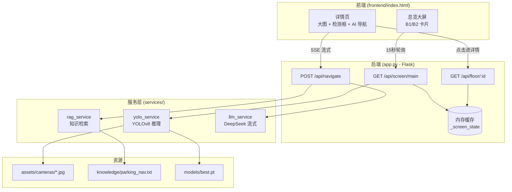

# 🚗 Parking-YOLO


> **智能停车场视觉感知与导航系统** — 端到端 AI 应用原型

> 集成 YOLOv8 目标检测 + RAG 知识检索 + LLM 流式生成，实现从"看见车位"到"用自然语言引导车主"的完整闭环。


[](https://www.python.org/)

[](https://flask.palletsprojects.com/)

[](https://github.com/ultralytics/ultralytics)

[](LICENSE)


---


## 📸 效果展示


### 实时监控大屏


### YOLO 检测框可视化


---


## ✨ 项目亮点


### 1. 三阶段防幻觉流水线


传统 LLM 应用最容易翻车的地方是"AI 编造数据"。本项目用一条清晰的流水线规避：


```

车位数字  ──100% 来自 YOLO ──→  作为"事实"注入提示词

导航路线  ──100% 来自 RAG  ──→  作为"约束"注入提示词

LLM 只负责 ──把事实和约束组织成自然语言

```


- **数字绝不让 LLM 生成** → 杜绝"AI 编造车位数"

- **路线绝不凭空生成** → 杜绝"AI 虚构导航路线"

- **LLM 只做"措辞"** → 把幻觉风险压到最低


### 2. 状态一致性缓存


大屏 15 秒随机切换监控画面 → 用户点击进详情页时读取**同一份检测结果**。保证"你看到的图片"和"你看到的数字"始终一致。


### 3. SSE 流式导航


`/api/navigate` 使用 Server-Sent Events 逐 token 推送，前端打字机效果渲染，体验接近 ChatGPT。


### 4. 降级与兜底


- YOLO 推理失败 → 返回结构化错误，前端不崩

- 知识库缺失 → 使用内置 fallback 知识

- LLM 限流 (429) → 指数退避重试 3 次

- LLM 彻底失败 → yield 兜底话术，不中断 SSE 流

- **前端后端未启动时也能跑** → 使用 MOCK 数据演示界面


---


## 📊 训练结果

基于 PKLot 公开数据集（12,417 张预处理图像）微调 YOLOv8n，训练 32 epoch，最佳结果出现在第 29 epoch。

| 指标 | 值 |
|---|---|
| mAP50-95 | **0.96544** |
| mAP50 | 0.9945 |
| Precision | 0.99819 |
| Recall | 0.99832 |
| 推理速度 | 10 FPS（本机 GPU） |

**训练曲线（部分 epoch）**：

| Epoch | box_loss | cls_loss | mAP50-95 | mAP50 | Precision | Recall |
|---|---|---|---|---|---|---|
| 1 | 1.46455 | 1.27619 | 0.70777 | 0.9662 | 0.94913 | 0.96336 |
| 5 | 0.74416 | 0.45585 | 0.84768 | 0.9915 | 0.96838 | 0.96814 |
| 10 | 0.59998 | 0.37126 | 0.90652 | 0.9942 | 0.98941 | 0.99078 |
| 15 | 0.54453 | 0.33342 | 0.92938 | 0.9943 | 0.99429 | 0.99335 |
| 20 | 0.50043 | 0.30440 | 0.94059 | 0.9944 | 0.99622 | 0.99615 |
| 25 | 0.45823 | 0.28493 | 0.95703 | 0.9945 | 0.99778 | 0.99778 |
| **29** | **0.44000** | **0.26978** | **0.96544** | **0.9945** | **0.99819** | **0.99832** |
| 32 | 0.42437 | 0.26548 | 0.96461 | 0.9945 | 0.99777 | 0.99749 |

> 训练环境：本机 GPU · 数据集：[PKLot](https://web.inf.ufpr.br/vri/databases/parking-lot-database/) · 基础模型：YOLOv8n

---
## 🛠️ 技术栈


| 层 | 技术 | 说明 |

|---|---|---|

| **视觉模型** | YOLOv8 (ultralytics 8.2) | 车位检测，3 类：`spaces` / `space-empty` / `space-occupied` |

| **后端框架** | Flask 3.0 + flask-cors | RESTful API + SSE 流式接口 |

| **LLM** | DeepSeek Chat API (OpenAI 兼容 SDK) | 导航话术生成，支持流式 |

| **RAG 检索** | Jaccard 相似度 + 中文 bigram 分词 | 零依赖、启动快（可平滑替换为向量检索） |

| **图像处理** | Pillow 10.3 | 图片加载、Base64 解码 |

| **前端** | 原生 HTML/CSS/JS（单文件） | Canvas 绘制检测框，无框架依赖 |

| **日志** | 结构化 JSON | 便于接入 ELK / Loki |


---


## 🏗️ 系统架构





**数据流**：


1. **大屏刷新**：前端每 15 秒调 `/api/screen/main` → 后端为 B1/B2 各随机抽一张图 → YOLO 检测 → 缓存结果 → 返回

2. **查看详情**：前端调 `/api/floor/B1` → 后端直接读缓存 → 保证与大屏一致

3. **AI 导航**：前端 POST `/api/navigate` → 后端从缓存取检测数据 + RAG 检索导航知识 → 拼提示词 → LLM 流式生成 → SSE 推送给前端


---


## 🚀 快速开始


### 1. 环境要求


- Python 3.10+

- pip

- （可选）CUDA 环境可显著加速 YOLO 推理，CPU 也能跑


### 2. 克隆项目


```bash

git clone https://github.com/banzhikaoyuOvo/parking-yolo.git

cd parking-yolo

```


### 3. 安装依赖


```bash

pip install -r requirements.txt

```


### 4. 下载模型权重


模型文件 (`best.pt`, 17.6 MB) 托管在 Releases，不进入 Git 仓库。


从 [Releases v1.0.0](https://github.com/banzhikaoyuOvo/parking-yolo/releases/tag/v1.0.0) 下载 `best.pt`，放到：


```

parking-yolo/

└── models/

    └── best.pt

```


### 5. 配置 API Key


复制环境变量模板：


```bash

cp .env.example .env

```


编辑 `.env`，填入你的 DeepSeek API Key：


```env

DEEPSEEK_API_KEY=sk-your-real-key-here

```


> API Key 申请地址：https://platform.deepseek.com/


### 6. 启动服务


```bash

python app.py

```


看到如下输出即为成功：


```

正在加载 YOLO 模型: .../models/best.pt

YOLO 模型加载完成 | 类别: ['spaces', 'space-empty', 'space-occupied'] | 置信度阈值: 0.5

RAG 知识库加载完成 | 来源: .../knowledge/parking_nav.txt | 条目数: 6

 * Running on http://0.0.0.0:5000

```


### 7. 打开浏览器


访问 http://localhost:5000


**快捷键**：`1` 进入 B1 详情 · `2` 进入 B2 详情 · `Esc` 返回大屏


---


## 📡 API 文档


### `GET /api/screen/main` — 大屏总览


随机抽取 B1/B2 各一张监控图并执行 YOLO 检测。


**响应**：


```json

{

  "code": 200,

  "data": {

    "B1": {

      "floor_id": "B1",

      "floor_name": "地下一层",

      "image_file": "b1_50.jpg",

      "image_url": "/assets/cameras/b1_50.jpg",

      "total_spaces": 45,

      "occupied": 22,

      "vacant": 23,

      "occupancy_rate": 48.9,

      "detections": [

        {"class": "space-empty", "confidence": 0.87, "bbox": [120.5, 340.2, 210.8, 410.6]}

      ]

    },

    "B2": {}

  },

  "server_time": "17:26:03",

  "refresh_count": 42

}

```


### `GET /api/floor/<floor_id>` — 楼层详情


返回缓存中的检测结果（与大屏一致）。`floor_id` 取 `B1` 或 `B2`。


### `POST /api/navigate` — AI 导航（SSE 流式）


**请求体**：


```json

{ "floor": "B1" }

```


**响应**（`text/event-stream`）：


```

data: {"token": "收到"}

data: {"token": "！B1"}

data: {"token": "层目前"}

...

data: [DONE]

```


### `POST /detect` — 上传图片检测（兼容接口）


**请求体**：


```json

{ "image": "data:image/png;base64,iVBORw0..." }

```


**响应**：`{ detections, total, occupied, vacant, advice }`


### `POST /api/admin/reload-knowledge` — 热重载知识库


修改 `knowledge/parking_nav.txt` 后调用，无需重启服务。


### `GET /api/health` — 健康检查


```json

{

  "status": "ok",

  "service": "xiaoyu-parking",

  "version": "v4.0-yolo-rag",

  "yolo_loaded": true,

  "rag_entries": 6

}

```


---


## 📁 项目结构


```

parking-yolo/

├── app.py                     # Flask 主服务 + API 路由

├── config.py                  # 全局配置 + LLM 系统提示词

├── requirements.txt           # Python 依赖

├── .env.example               # 环境变量模板

├── LICENSE                    # MIT

├── README.md

│

├── services/                  # 服务层（单例模式）

│   ├── __init__.py

│   ├── yolo_service.py        # YOLOv8 检测封装

│   ├── rag_service.py         # RAG 知识检索

│   └── llm_service.py         # DeepSeek 流式/非流式调用

│

├── frontend/

│   └── index.html             # 单文件前端（监控大屏 + 详情页）

│

├── assets/

│   └── cameras/               # 模拟摄像头画面（8 张）

│       ├── b1_empty.jpg

│       ├── b1_20.jpg

│       ├── b1_50.jpg

│       ├── b1_90.jpg

│       ├── b2_empty.jpg

│       ├── b2_20.jpg

│       ├── b2_50.jpg

│       └── b2_full.jpg

│

├── knowledge/

│   └── parking_nav.txt        # RAG 知识库（每行一条规则）

│

├── models/                    # YOLO 权重（.gitignore，从 Release 下载）

│   └── best.pt

│

└── training/

    └── parking_data.yaml      # YOLOv8 训练数据集配置

```


---


## 🎓 模型训练


模型使用 YOLOv8n 微调，3 个类别：


| 类别 | 含义 |

|---|---|

| `spaces` | 车位整体区域（用于辅助标注，不参与计数） |

| `space-empty` | 空闲车位 |

| `space-occupied` | 已占用车位 |


训练配置见 [`training/parking_data.yaml`](training/parking_data.yaml)。


复现训练（需自备数据集）：


```bash

yolo detect train data=training/parking_data.yaml model=yolov8n.pt epochs=100 imgsz=640

```


---


## 🔧 配置说明


所有可调参数集中在 `config.py`：


| 配置项 | 说明 | 默认值 |

|---|---|---|

| `YOLO_MODEL_PATH` | 模型权重路径 | `models/best.pt` |

| `YOLO_CONFIDENCE_THRESHOLD` | 检测置信度阈值 | 0.5 |

| `CAMERA_POOL` | 楼层-图片映射（含每层车位数） | B1: 120, B2: 80 |

| `RAG_TOP_K` | RAG 返回 Top-K 条知识 | 3 |

| `LLM_MODEL` | LLM 模型名 | `deepseek-chat` |

| `STREAM_CHUNK_SIZE` | SSE 每次推送字符数 | 2 |

| `SCREEN_REFRESH_INTERVAL` | 前端刷新间隔（秒） | 15 |


---


## 🚢 生产部署建议


开发环境使用 `flask run`，生产环境建议：


```bash

# Linux / macOS

gunicorn -w 4 -b 0.0.0.0:5000 app:app


# Windows

waitress-serve --port=5000 app:app

```


**注意事项**：


- 关闭 `app.run(debug=True)`，改为读环境变量 `FLASK_DEBUG`

- CORS 收紧到指定域名

- 多 worker 时 `_screen_state` 内存缓存会失效，应改用 Redis


---


## 🗺️ 后续规划


- [ ] RAG 升级为 `sentence-transformers` + FAISS 向量检索

- [ ] 接入真实 RTSP 摄像头推流（OpenCV 定时截帧）

- [ ] 多楼层支持（B3、B4…）

- [ ] 车位预约 + 反向寻车

- [ ] Docker 部署

- [ ] 单元测试（pytest + mock LLM）


---


## 📄 License


[MIT](LICENSE) © 2026 banzhikaoyuOvo


---


## 🙏 致谢


- [Ultralytics YOLOv8](https://github.com/ultralytics/ultralytics)

- [DeepSeek](https://platform.deepseek.com/)

- [Flask](https://flask.palletsprojects.com/)


